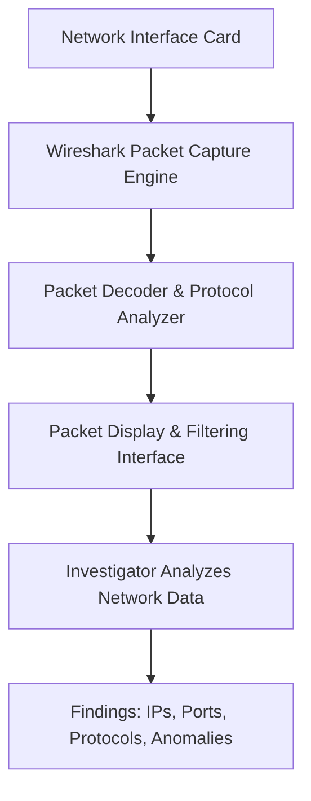

# Network-traffic-capture-and-analysis-with-Wireshark
## AIM:
To capture and analyze network traffic using Wireshark in order to observe protocols, packets, and potential anomalies.
## Requirements:
- **Hardware:**
    - Computer with internet access
    - Network adapter (Ethernet/Wi-Fi)
- **Software:**
    - Wireshark (latest stable version)
    - Sample PCAP files (optional for offline analysis)
## Architecture:

```mermaid
flowchart TD
    A[Network Interface Card] --> B[Wireshark Packet Capture Engine]
    B --> C[Packet Decoder & Protocol Analyzer]
    C --> D[Packet Display & Filtering Interface]
    D --> E[Investigator Analyzes Network Data]
    E --> F[Findings: IPs, Ports, Protocols, Anomalies]
```
## DESIGN STEPS:
### Step 1:
Install Wireshark on the system.

### Step 2:
Launch Wireshark and select the network interface (Ethernet/Wi-Fi).

### Step 3:
Start the capture, apply filters (like http, tcp, ip.addr == x.x.x.x) to analyze specific traffic, and stop the capture after observing relevant data.
### Step 4:
**Analyze traffic to identify:**
  - Source & Destination IP addresses
  - Protocols (HTTP, DNS, TCP, UDP, etc.)
  - Suspicious activities (e.g., unusual ports, repeated requests).
## PROGRAM:
Wireshark Packet Capture and Filter Usage

## OUTPUT:
Captured Packets with Protocol Analysis and Detailed Packet Info

## RESULT:
Network traffic was successfully captured and analyzed using Wireshark.
